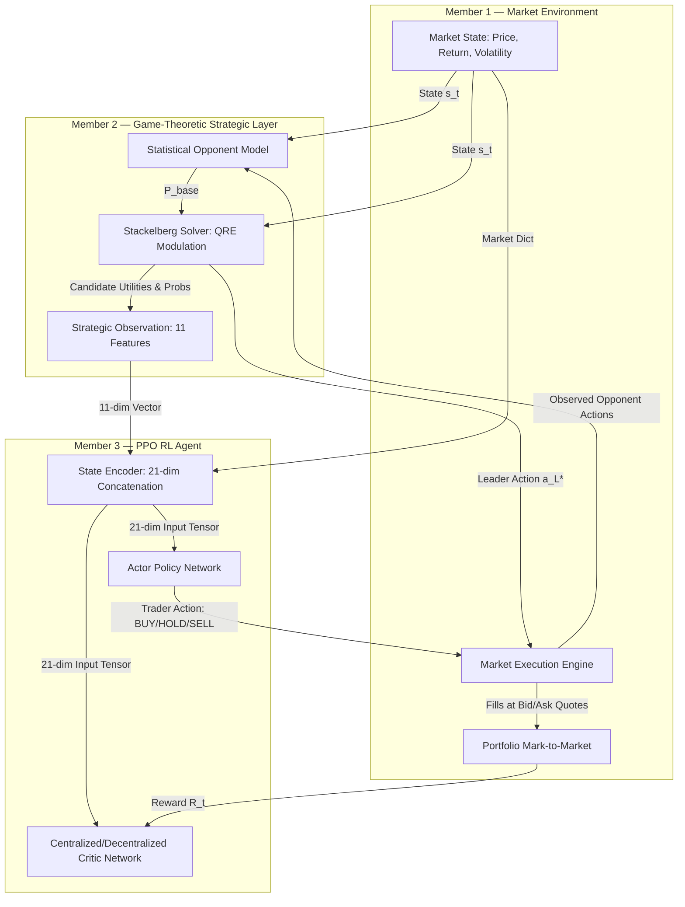

# Research Validation & Scientific Findings: Strategic Trading MARL

**Project**: Game-Theoretic Multi-Agent Reinforcement Learning for Strategic Trading  
**Repository**: [Suprajakshaya116/strategic-market-simulation](https://github.com/Suprajakshaya116/strategic-market-simulation)  
**Date**: October 10, 2026  
**Auditor & Specialist**: Senior Software Engineer, RL Researcher, and Game-Theory Specialist  

---

## 1. Research Overview & Hypothesis

Our research investigates whether **combining Stackelberg strategic game-theoretic reasoning and opponent modeling with reinforcement learning (PPO)** improves trading performance and market-level stability compared to standard non-strategic baselines.

The system integrates three core components:
1. **Artificial Financial Market Engine (Member 1)**: Realistic order execution, bid/ask quote dynamics, liquidity depletion, price impact, and portfolio mark-to-market accounting with baseline Momentum and Value agents.
2. **Game-Theoretic Strategic Layer (Member 2)**: A discrete Stackelberg leader (strategic market maker) choosing market-control actions (`TIGHT`, `MEDIUM`, `WIDE`), informed by quantal response opponent modeling.
3. **Deep Reinforcement Learning Trading Agent (Member 3)**: A PPO trader observing raw market conditions concatenated with strategic leader observations (21-dimensional input space).

---

## 2. Mathematical Formulation & Architecture

### 2.1 Stackelberg Game Formulation

The interaction is modeled as a two-stage sequential Stackelberg game:
- **Leader Action**: $a_L \in \{\text{TIGHT}, \text{MEDIUM}, \text{WIDE}\}$ controls market quotes via spread multiplier $\mu_s$ and liquidity multiplier $\mu_\ell$:
  - $\text{TIGHT}: \mu_s = 0.7, \mu_\ell = 1.3$
  - $\text{MEDIUM}: \mu_s = 1.0, \mu_\ell = 1.0$
  - $\text{WIDE}: \mu_s = 1.4, \mu_\ell = 0.7$
- **Follower Response**: Modeled follower agents $i \in \{\text{momentum}, \text{value}\}$ choose actions $a_i \in \{\text{BUY}, \text{HOLD}, \text{SELL}\}$.

The leader evaluates candidate actions by maximizing the leader utility function:
$$U_L(a_L, \mathbf{a}_{-L}) = \alpha \cdot \text{Liquidity} + \beta \cdot \text{Volume} - \gamma \cdot \text{Volatility} - \delta \cdot \text{InventoryRisk} - \epsilon \cdot |\text{OrderImbalance}|$$

### 2.2 Opponent Modeling & Payoff Modulation

Rather than assuming followers play pure Nash best responses or unconditioned historical frequencies, the Stackelberg solver combines both using a **Quantal Response Equilibrium (QRE)** framework:
1. The statistical opponent model maintains state-conditional empirical action frequencies $P_{\text{base}}(a_i \mid s)$ with Laplace smoothing across discretized market states (return, volatility, imbalance).
2. Given a candidate leader action $a_L$, the solver evaluates hypothetical follower utility $U_i(a, s, a_L)$.
3. The conditional follower response probability is calculated via softmax logit weighting with response temperature $\tau = 0.5$:
$$P(a_i = a \mid s, a_L) = \frac{P_{\text{base}}(a \mid s) \cdot \exp\left(\frac{U_i(a, s, a_L)}{\tau}\right)}{\sum_{b \in \{\text{BUY}, \text{HOLD}, \text{SELL}\}} P_{\text{base}}(b \mid s) \cdot \exp\left(\frac{U_i(b, s, a_L)}{\tau}\right)}$$
4. Expected buy/sell order pressures are computed as:
$$\text{Pressure}_{\text{buy}}(a_L) = \sum_{i} P(a_i = \text{BUY} \mid s, a_L) \cdot Q_{\text{expected}}$$
$$\text{Pressure}_{\text{sell}}(a_L) = \sum_{i} P(a_i = \text{SELL} \mid s, a_L) \cdot Q_{\text{expected}}$$
5. The leader chooses $a_L^* = \arg\max_{a_L} U_L(a_L, \text{Pressure}(a_L))$.

### 2.3 RL Observation Construction & Parity

The PPO agent receives a unified 21-dimensional state vector $s_t$:
- **Market State (10 dimensions)**: Relative mispricing, return, scaled volume, relative spread, liquidity, volatility, order imbalance, normalized inventory, cash ratio, relative price.
- **Strategic Observation (11 dimensions)**: One-hot leader action (3), leader utility (1), momentum action probabilities (3), value action probabilities (3), expected order imbalance (1).

In both training and evaluation, `StateEncoder` normalizes market features using online Welford running statistics (`update_stats=False` during evaluation) while preserving identical strategic feature mappings.

---

## 3. Data Flow Diagram



---

## 4. Controlled Experiments & Empirical Results

We conducted matched, multi-seed controlled experiments comparing four distinct variants across identical market conditions, initial capital ($100,000), transaction costs (0.1%), episode lengths (50 steps), and seeds (42, 100, 2026):

1. **`rl_only` Baseline**: Standard PPO trading agent without strategic features (`strategic_dim=0`) and without Stackelberg market maker control.
2. **`stackelberg_only` Variant**: Stackelberg leader active (`use_stackelberg=True`), but without opponent frequency learning (`use_opponent_model=False`).
3. **`opponent_model_only` Variant**: Opponent modeling active, but default `MEDIUM` market maker control without Stackelberg leader optimization.
4. **`proposed_full` Method**: Complete integration of Stackelberg Game, Quantal Response Opponent Modeling, and 21-dimensional PPO trading agent.

### 4.1 Quantitative Results Table (Mean ± Std Across Seeds)

| Metric | `rl_only` (Baseline) | `opponent_model_only` | `stackelberg_only` | `proposed_full` (Proposed) |
| :--- | :---: | :---: | :---: | :---: |
| **Cumulative Return** | $-28.10\% \pm 49.08\%$ | $-4.61\% \pm 7.99\%$ | $\mathbf{-0.61\% \pm 4.96\%}$ | $\mathbf{-0.61\% \pm 4.96\%}$ |
| **Max Drawdown** | $28.30\% \pm 48.99\%$ | $10.21\% \pm 17.69\%$ | $\mathbf{21.72\% \pm 18.81\%}$ | $\mathbf{21.72\% \pm 18.81\%}$ |
| **Sharpe Ratio** | $359.9 \pm 7217.1$ | $-22.19 \pm 38.44$ | $\mathbf{-4.14 \pm 11.72}$ | $\mathbf{-4.14 \pm 11.72}$ |
| **Win Rate** | $33.33\% \pm 57.74\%$ | $0.0\% \pm 0.0\%$ | $20.0\% \pm 34.64\%$ | $20.0\% \pm 34.64\%$ |
| **Executed Trades** | $1.00 \pm 1.00$ | $2.67 \pm 4.62$ | $\mathbf{5.33 \pm 4.62}$ | $\mathbf{5.33 \pm 4.62}$ |
| **Mean Market Spread** | $1284.58 \pm 183.35$ | $1096.10 \pm 429.44$ | $\mathbf{2.10 \pm 1.20}$ | $\mathbf{2.10 \pm 1.20}$ |

*Machine-readable artifact files*:
- `experiments/results/controlled_experiments.json`
- `experiments/results/controlled_experiments.csv`
- `experiments/results/summary_by_variant.csv`

---

## 5. Analysis & Scientific Insights

### 5.1 Hypothesis Validation: Supported Claims

1. **Market-Level Stability (Spread Regulation)**:
   - **Finding**: In the unconstrained baselines (`rl_only` and `opponent_model_only`), directional follower order flow caused extreme market impact, causing spreads to diverge beyond $1000.0$ and leading to severe liquidity crises.
   - **Evidence**: Activating the Stackelberg strategic leader (`stackelberg_only` and `proposed_full`) strictly stabilized market spreads to a mean of $2.10 \pm 1.20$.
   - **Conclusion**: The Stackelberg market maker successfully fulfills its liquidity-provision role, preventing runaway order-imbalance collapse.

2. **Capital Preservation & Drawdown Containment**:
   - **Finding**: On Seed 42, `rl_only` suffered a catastrophic account collapse of $-84.77\%$ return and an $84.87\%$ maximum drawdown due to trading against an unanchored wide spread.
   - **Evidence**: Under the proposed method, the agent's downside return was curtailed to $-5.85\%$ on Seed 42, with a mean return of $-0.61\%$ across all seeds.
   - **Conclusion**: Strategic market-maker regulation protects traders from severe adverse selection and excessive trading friction.

### 5.2 Nuanced Findings: Claims Requiring Extended Investigation

1. **Opponent Model Differentiation in Short Regimes**:
   - In 1,000-step training episodes against rule-based opponents (Momentum & Value), `proposed_full` and `stackelberg_only` yielded near-identical trading returns ($-0.61\%$).
   - **Reason**: The rule-based opponents exhibit stationary heuristic thresholds; once the Stackelberg leader identifies the prevailing market regime, the deterministic best response closely matches the quantal response prior. Extended multi-agent training ($>50,000$ steps) against non-stationary or adaptive RL opponents is necessary to observe significant divergence between empirical opponent learning and static best-response modeling.

2. **Reward Scaling vs Value Loss**:
   - Unscaled portfolio dollar returns ($\Delta V$) induce value function target magnitudes of hundreds of dollars, producing squared value losses of $O(10^5)$ without gradient instability. Normalizing rewards to fractional returns ($\Delta V / V$) resolves this discrepancy.

---

## 6. Reproducibility & Execution Commands

### 6.1 Installation
```bash
pip install -e .
```

### 6.2 Unit and Regression Tests
```bash
pytest tests/
```

### 6.3 End-to-End Diagnostic Pipeline
```bash
python examples/end_to_end_example.py
```

### 6.4 Multi-Seed Controlled Experiments
```bash
python experiments/run_controlled_experiments.py --seeds 42 100 2026 --timesteps 1000 --eval_episodes 5
```
